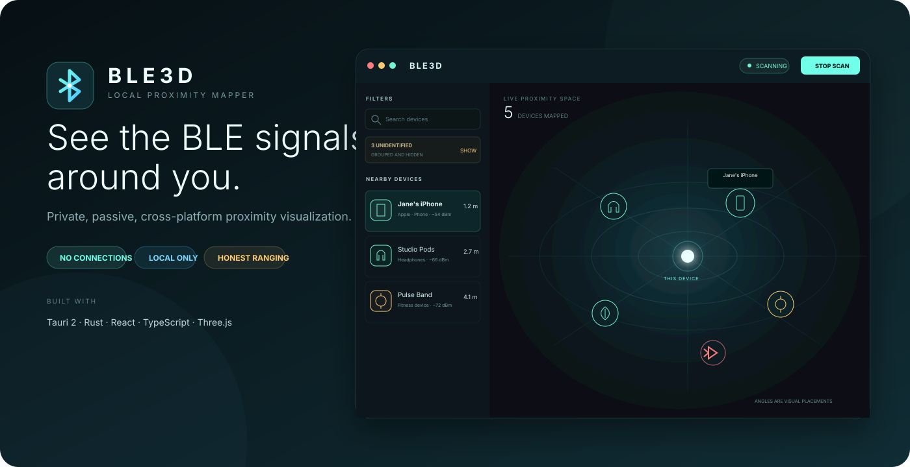
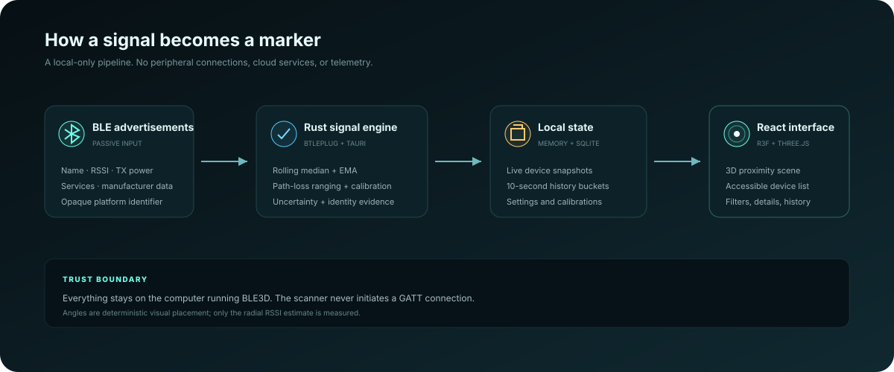

<div align="center">
  

  # BLE3D

  **A private, cross-platform 3D proximity mapper for nearby Bluetooth Low Energy signals.**

  [](https://v2.tauri.app/)
  [](https://www.rust-lang.org/)
  [](https://react.dev/)
  [](https://www.typescriptlang.org/)
  [](#privacy-and-security)
  [](#project-status)

  [Overview](#overview) · [Quick start](#quick-start) · [Architecture](#architecture) · [Contributing](#contributing) · [Roadmap](#roadmap)
</div>



## Overview

BLE3D passively discovers advertising BLE devices and turns their signals into an interactive radial map. The computer running BLE3D is fixed at the origin. Devices move inward or outward as filtered RSSI changes, while stable synthetic angles keep the scene readable.

BLE3D never connects to discovered peripherals and does not send discovery data to a server. It is designed for local radio exploration, hardware debugging, classroom demonstrations, and proximity experiments.

> [!IMPORTANT]
> BLE3D is a **proximity visualization**, not physical XYZ positioning. One ordinary BLE receiver can estimate rough radial distance from RSSI but cannot measure direction. Marker angles are clearly labeled visual placements, not measured bearings.

### Why BLE3D?

| Inspect | Understand | Experiment |
| --- | --- | --- |
| See active and stale BLE advertisers without opening connections. | Inspect names, services, manufacturer identifiers, signal history, range confidence, and identity evidence. | Run repeatable simulations, create device-specific calibrations, and test ranging behavior without cloud infrastructure. |

## Highlights

- Passive, non-connecting BLE discovery through [`btleplug`](https://github.com/deviceplug/btleplug)
- macOS, Windows, and Linux architecture through Tauri 2 and Rust
- Rolling-median and exponential-moving-average RSSI filtering
- Log-distance path-loss ranging with configurable display limits
- Generic, advertised-TX, shared-environment, and per-device calibration layers
- Numeric uncertainty and low/medium/high range confidence
- Evidence-based device type classification with identified/probable/limited grades
- Bluetooth SIG company and standard-service assigned-number labels
- Device-specific icons that stay constant in screen size while the camera zooms
- Search and filters for range, RSSI, identity, service, manufacturer, confidence, and state
- Keyboard-accessible device list equivalent to the 3D scene
- Local SQLite history, ten-second aggregation, and one-minute compaction after 24 hours
- Development-only simulated scanner for deterministic testing and demos

## Device identification

BLE advertisements often contain very little identifying information. BLE3D combines several independent clues and explains exactly what produced each label:

1. Advertised local and advertisement names
2. Standard Bluetooth service UUIDs
3. Bluetooth device class when the operating system exposes it
4. Manufacturer-data signatures such as iBeacon
5. Recognized member services such as Eddystone and Fast Pair
6. Bluetooth SIG company identifiers

Labels are deliberately conservative. A company identifier owns a manufacturer-data format; it does **not** always identify the finished product manufacturer. Evidence-poor signals remain **unidentified** and are grouped off the map by default instead of being given an invented device type.

## How ranging works

```text
advertisement RSSI → rolling median → EMA → path-loss model → clamped radial range
                                             └────────────→ uncertainty + confidence
```

The host is always `(0, 0, 0)`. Only the marker radius comes from the BLE signal estimate. Azimuth and elevation are deterministic hashes of the opaque platform identifier, so the same live device keeps a stable visual lane.

Calibration improves consistency, but it cannot remove antenna orientation, body obstruction, multipath reflections, transmitter variation, or operating-system filtering. BLE3D exposes uncertainty instead of presenting RSSI ranging as exact.

## Architecture



| Layer | Technology | Responsibility |
| --- | --- | --- |
| Desktop shell | Tauri 2 | Native window, commands, events, permissions, packaging |
| Scanner | Rust + `btleplug` | Adapter state, passive discovery, normalized advertisements |
| Signal engine | Rust | Filtering, calibration precedence, ranging, uncertainty, stale transitions |
| Persistence | SQLite + `rusqlite` | Devices, aliases, observation summaries, settings, calibrations |
| Interface | React + TypeScript | Filters, accessible list, details, calibration and settings flows |
| Visualization | React Three Fiber + Three.js | Proximity shells, radial animation, stable layout, camera controls |

Live snapshots are emitted to the UI at no more than four updates per second. Advertisement samples stay in memory; summarized buckets are persisted locally.

## Project status

BLE3D is an early preview intended for contributors and technical users.

| Platform | Build architecture | Hardware validation |
| --- | :---: | :---: |
| macOS | ✅ | ✅ Primary target |
| Windows | ✅ | 🧪 Community testing wanted |
| Linux / BlueZ | ✅ | 🧪 Community testing wanted |

The app currently scans only while its desktop window is open. Phones and computers that are not actively advertising may be invisible. Platform identifiers can rotate; BLE3D intentionally does not merge them heuristically.

## Quick start

### Prerequisites

- [Node.js](https://nodejs.org/) 20 or later
- [Rust stable](https://www.rust-lang.org/tools/install)
- [Tauri 2 desktop prerequisites](https://v2.tauri.app/start/prerequisites/)
- A Bluetooth Low Energy adapter

### Run from source

```bash
git clone <your-fork-or-repository-url>
cd BLE3D
npm install
npm run tauri dev
```

Select **Start scan** in the application. On macOS, approve the Bluetooth permission prompt. BLE3D requests scan access only; it never initiates GATT connections.

### Build a desktop bundle

```bash
npm run tauri build
```

To build only the macOS application bundle:

```bash
npm run tauri build -- --bundles app
```

## Platform setup

<details>
<summary><strong>macOS</strong></summary>

Install Xcode Command Line Tools or Xcode. BLE3D targets macOS 10.15 or later and includes `NSBluetoothAlwaysUsageDescription`. If access was previously denied, enable BLE3D under **System Settings → Privacy & Security → Bluetooth**.

</details>

<details>
<summary><strong>Windows</strong></summary>

Install Microsoft C++ Build Tools with **Desktop development with C++** and the WebView2 runtime. Windows 10 or later is recommended for the native BLE backend.

</details>

<details>
<summary><strong>Linux</strong></summary>

Install the Tauri WebKitGTK prerequisites, BlueZ, and D-Bus development packages. The current user must be allowed to access the system BlueZ service. On Debian/Ubuntu, common packages include `libwebkit2gtk-4.1-dev`, `libdbus-1-dev`, `libbluetooth-dev`, and `bluez`.

</details>

## Development

```bash
# Frontend development server
npm run dev

# Complete desktop development app
npm run tauri dev

# Frontend tests
npm test

# Type-check and production frontend build
npm run build

# Rust tests
cargo test --manifest-path src-tauri/Cargo.toml

# Full project check
npm run check
```

### Simulated scanner

Development builds include deterministic devices for working without nearby BLE hardware:

1. Stop an active scan.
2. Open **Settings & data**.
3. Enable **Simulated scanner** and save.
4. Start scanning again.

The simulator exercises named and unnamed devices, missing TX power, standard services, confidence changes, history aggregation, and stale-device behavior. It is unavailable in production builds.

### Repository map

```text
BLE3D/
├── src/                         React application
│   ├── components/              Scene, panels, charts, calibration, settings
│   ├── data/                    Bluetooth SIG assigned-number data
│   ├── hooks/                   Live Tauri event state
│   └── lib/                     Classification, filters, layout, frontend API
├── src-tauri/
│   ├── src/scanner.rs           Real and simulated advertisement streams
│   ├── src/ranging.rs           Filtering, distance, uncertainty, placement
│   ├── src/database.rs          SQLite schema, aggregation, compaction
│   └── src/lib.rs               Tauri commands and application lifecycle
├── docs/images/                 README and architecture visuals
└── .github/                     Issue and pull-request templates
```

## Local data

BLE3D stores `ble3d.sqlite3` in the operating system's Tauri application-data directory. It persists:

- Discovered-device summaries and aliases
- Ten-second observation buckets
- One-minute compacted history older than 24 hours
- Calibration profiles
- Display and ranging settings

**Clear discovery history** removes device metadata and observation summaries after confirmation while preserving settings and calibration profiles. Calibration profiles have separate delete controls.

## Privacy and security

- No cloud service, analytics SDK, account, or telemetry
- No automatic or user-triggered GATT connections in this version
- No heuristic merging of rotated platform identifiers
- Opaque operating-system identifiers remain local
- Development simulation is compiled out of release builds

Please report vulnerabilities privately according to [SECURITY.md](SECURITY.md).

## Roadmap

- [x] Passive cross-platform scanner architecture
- [x] Filtered RSSI ranging and uncertainty
- [x] Device identification evidence and type icons
- [x] Accessible list, filters, details, history, and aliases
- [x] Guided 1 m / 3 m calibration
- [x] SQLite aggregation and compaction
- [ ] Windows hardware acceptance and installer validation
- [ ] Linux distribution/BlueZ acceptance matrix
- [ ] Exportable anonymized diagnostic captures
- [ ] User-defined device-type overrides
- [ ] Optional phone beacon/sensor companion experiments
- [ ] Multi-receiver positioning research
- [ ] Bluetooth direction-finding hardware support

Roadmap items are proposals, not release commitments. Design discussions and focused prototypes are welcome.

## Contributing

BLE3D is looking for contributors interested in Bluetooth, Rust, desktop apps, signal processing, data visualization, accessibility, and cross-platform testing.

Good first contributions include:

- Testing BLE adapters on Windows or Linux and documenting results
- Adding cautious, test-backed device classification rules
- Improving keyboard and screen-reader behavior
- Expanding simulated failure scenarios
- Profiling high-device-count scenes
- Writing platform setup and troubleshooting guides

Read [CONTRIBUTING.md](CONTRIBUTING.md) before opening a pull request. For substantial changes, start with an issue so the design can be discussed before implementation. All community participation is covered by the [Code of Conduct](CODE_OF_CONDUCT.md).

## Community standards

- [Contributing guide](CONTRIBUTING.md)
- [Code of Conduct](CODE_OF_CONDUCT.md)
- [Security policy](SECURITY.md)
- [Bug report template](.github/ISSUE_TEMPLATE/bug_report.yml)
- [Feature request template](.github/ISSUE_TEMPLATE/feature_request.yml)

## Acknowledgements

BLE3D builds on the work of the [Tauri](https://tauri.app/), [`btleplug`](https://github.com/deviceplug/btleplug), [React Three Fiber](https://r3f.docs.pmnd.rs/), [Three.js](https://threejs.org/), and [Bluetooth SIG Assigned Numbers](https://www.bluetooth.com/specifications/assigned-numbers/) communities.

---

<div align="center">
  <strong>Build carefully. Measure honestly. Keep the radio data local.</strong>
</div>
